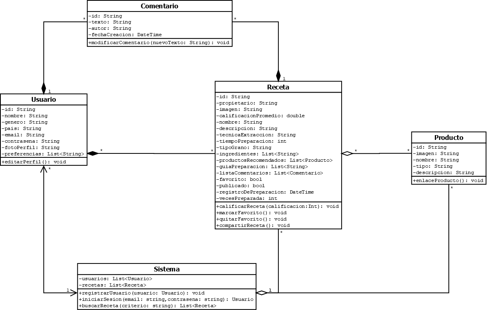

# BrownDream

## Descripción

BrownDream es una aplicación desarrollada en Flutter que aborda la necesidad de LIRCAYHUB de contar con una plataforma para recetas de café, evaluando su viabilidad y aceptación a través de una validación con un grupo de usuarios. Esta aplicación permitirá a aficionados y baristas gestionar, compartir y descubrir recetas de café manera eficiente. Ofrecerá un entorno integral para conocer, crear, explorar y compartir preparaciones, satisfaciendo así la demanda de quienes buscan perfeccionar sus técnicas y enriquecer su experiencia con el café.

### Requerimientos funcionales

- La aplicación debe permitir a los usuarios poder marcar recetas como favoritas y almacenarlas en una lista para su acceso.
- La aplicación debe permitir a los usuarios crear, editar y eliminar recetas de café.
- La aplicación debe permitir buscar y explorar recetas predefinidas o personalizadas.
- La aplicación debe proporcionar un filtro de búsqueda, permitiendo a los usuarios seleccionar sus preferencias, tales como técnica de extracción, tiempos de preparación, explorar nuevos ingredientes, tipo de grano y equipo utilizado, ajustando la búsqueda en consecuencia.
- La aplicación debe ofrecer guías de preparación para diferentes tipos de café.
- La aplicación debe permitir a los usuarios poder personalizar las recetas según sus preferencias.
- La aplicación debe permitir a los usuarios compartir recetas a través del dispositivo.
- La aplicación debe permitir a los usuarios calificar las recetas de café.
- La aplicación debe permitir a los usuarios dejar sus comentarios sobre su experiencia de preparación en cada receta de café.
- La aplicación debe ofrecer información sobre productos relacionados con el café, facilitando la preparación y adquisición de productos para las recetas.
- La aplicación debe ofrecer una interfaz de vista previa que muestre la información relevante de las recetas de café (imagen, nombre y método de preparación).
- La aplicación debe ofrecer una interfaz que muestre toda la información sobre las recetas de café (imagen, calificación, nombre, descripción, técnica de extracción, tiempo de preparación, tipo de grano, ingredientes, equipo utilizado, guía de preparación).
- La aplicación debe permitir crear y gestionar cuentas de usuario, con opciones para personalizar el perfil y poder indicar sus preferencias sobre el café (técnica de extracción, tipo de grano, equipo utilizado).
- La aplicación debe ser compatible y ajustarse automáticamente para dispositivos móviles, tabletas y computadoras de escritorio.

### Requerimientos no funcionales

- La aplicación debe contar con un rápido rendimiento, siendo capaz de cargar y mostrar las recetas de café en el menor tiempo posible.
- La aplicación debe garantizar la seguridad de los datos del usuario y proteger la información personal.
- La aplicación debe contar con una interfaz intuitiva y fácil de usar.
- La aplicación debe usar la menor cantidad de almacenamiento del dispositivo posible para su funcionamiento.

### Diagrama de clases

### Diagrama de arquitectura de información

### Video

A continuación, encontrarás el enlace al video en el que se presenta todo el trabajo realizado.

[video de exposición del trabajo realizado](https://youtu.be/IvAhdl_PyyU)