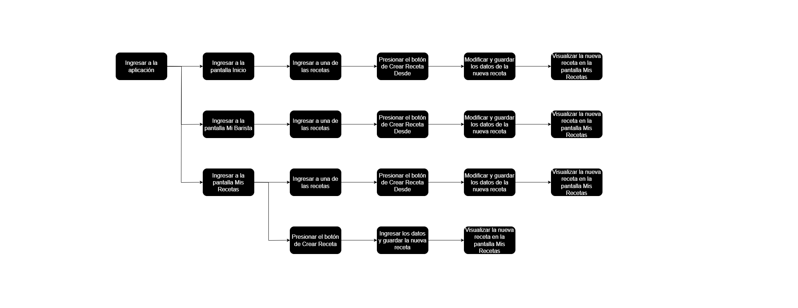

# BrownDream

## Descripción

BrownDream es una aplicación desarrollada en Flutter que aborda la necesidad de LIRCAYHUB de contar con una plataforma para recetas de café, evaluando su viabilidad y aceptación a través de una validación con un grupo de usuarios. Esta aplicación permitirá a aficionados y baristas gestionar, compartir y descubrir recetas de café manera eficiente. Ofrecerá un entorno integral para conocer, crear, explorar y compartir preparaciones, satisfaciendo así la demanda de quienes buscan perfeccionar sus técnicas y enriquecer su experiencia con el café.

Se han considerado los resultados de la encuesta proporcionada por el equipo de Marketing, realizada a un grupo de usuarios, para definir las funcionalidades de la aplicación. Se han priorizado aquellas características que recibieron una respuesta positiva, mientras que se han descartado las implementaciones que, según el feedback de los usuarios, no generaron buenos resultados Todo esto con el objetivo de garantizar una aplicación de café que satisfaga las necesidades del mercado y proporcione una experiencia óptima para los usuarios.

### Requerimientos funcionales

- La aplicación debe permitir a los usuarios crear, editar y eliminar recetas de café.
- La aplicación debe permitir buscar y explorar recetas predefinidas o personalizadas.
- La aplicación debe proporcionar un sistema de búsqueda para que el usuario pueda encontrar las recetas que desee preparar.
- La aplicación debe ofrecer guías de preparación para diferentes tipos de café.
- La aplicación debe permitir a los usuarios poder personalizar las recetas según sus preferencias.
- La aplicación debe permitir a los usuarios compartir recetas a través del dispositivo.
- La aplicación debe ofrecer información sobre productos relacionados con el café, facilitando la preparación y adquisición de productos para las recetas.
- La aplicación debe ofrecer una interfaz de vista previa que muestre la información relevante de las recetas de café (imagen, nombre y método de preparación).
- La aplicación debe ofrecer una interfaz que muestre toda la información sobre las recetas de café (imagen, nombre, descripción, técnica de extracción, tiempo de preparación, tipo de grano, ingredientes, equipo utilizado, guía de preparación).
- La aplicación debe ser compatible y ajustarse automáticamente para dispositivos móviles, tabletas y computadoras de escritorio.
- La aplicación debe permitir al usuario ver en la pantalla de inicio las últimas recetas que ha visitado, para facilitar el acceso rápido a ellas.
- La aplicación debe permitir al usuario ver cuántas veces ha preparado una receta en particular.
- La aplicación debe permitir al usuario registrar y ver el tiempo que ha tardado en preparar una receta de café, ayudando a hacer un seguimiento de su rendimiento.
-  La aplicación debe permitir al usuario agregar fotos a sus recetas, ya sea capturando una foto en el momento a través de la cámara o seleccionando una foto desde la galería del dispositivo.
- La aplicación debe incluir un apartado donde los usuarios puedan compartir su opinión sobre la aplicación mediante una encuesta, cuyos resultados serán enviados directamente al equipo de desarrollo.

### Requerimientos no funcionales

- La aplicación debe contar con un rápido rendimiento, siendo capaz de cargar y mostrar las recetas de café en el menor tiempo posible.
- La aplicación debe contar con una paleta de colores coherente y armoniosa a lo largo de toda la interfaz, garantizando una experiencia visual agradable y consistente.
- La aplicación debe garantizar la seguridad de los datos del usuario y proteger la información personal.
- La aplicación debe contar con una interfaz intuitiva y fácil de usar.
- La aplicación debe usar la menor cantidad de almacenamiento del dispositivo posible para su funcionamiento.
- La aplicación debe solicitar de manera clara y transparente los permisos necesarios para acceder a las funcionalidades del dispositivo.
- La aplicación debe utilizar almacenamiento persistente para garantizar que los datos importantes se mantengan durante el uso presente y futuro de la aplicación.

### Diagrama de arquitectura de información

### Diagrama de flujo - Registro de una Receta

### Video

A continuación, encontrarás el enlace al video en el que se presenta todo el trabajo realizado en esta nueva versión.

[Video de exposición del trabajo realizado](https://youtu.be/IvAhdl_PyyU)